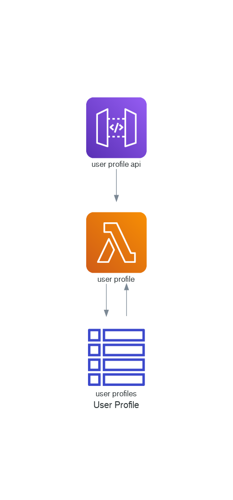

# Serverless User Profile Management

A user profile management function.



## Overview

User profiles provide the ability to record additional metadata about users and their roles and responsibilities
within a system. They also enable users to "wear many hats" in that they are able to perform different functions
under the guise of different user profiles.

Whilst user metadata typically pertains to information about a real person (e.g. Name, Date of Birth,
Contact details, etc.), a user profile consists of metadata related to a particular context or system.

This may include:

* Roles and permissions
* Nicknames and aliases
* Avatars
* Group membership and subscriptions
* Presence and status information


## Specification

### Input Event

The following JSON structure is used to create, update and retrieve user profiles.

#### Create user profile

```json
{
    "action": "create",
    "name": "Jazz Jackrabbit",
    "description": "Jumpy jumpy",
    "user": "johnd@example.com"
}
```

#### Create profile revision

```json
{
    "action": "revision",
    "uid": "1234",
    "summary": "An entry update",
    "description": "A longer text description",
    "organizer": "John Doe"
}
```

#### List user profiles

```json
{
    "action": "list",
    "uid": "1234",
    "depth": "-1"
}
```

#### User profile search

```json
{
    "action": "search",
    "from": "2020-01-01",
    "organizer": "johnd@example.com"
}
```

### DynamoDB

| PK                     | SK                          | Name            | User              | Status | Classification | Role    |
|------------------------|-----------------------------|-----------------|-------------------|--------|----------------|---------|
| USERPROFILE#`uid`      | #METADATA#`uid`             | Jazz Jackrabbit | johnd@example.com |        | PRIVATE        |         |
| USERPROFILE#`uid`      | USERGROUP#1                 | -               |                   |        |                | 1       |
| USERPROFILE#`uid`      | USERGROUPROLE#1             |                 |                   |        |                | COUNCIL |
| USERGROUP#1            | #METADATA#1                 | Carrot Village  |                   |        | PRIVATE        |         |
| USER#johnd@example.com | #METADATA#johnd@example.com | John Doe        |                   |        |                |         |
| USERROLE#COUNCIL       | #METADATA#COUNCIL           | Village Council |                   |        |                |         |
| USERROLE#CITIZEN       | #METADATA#CITIZEN           | Village Citizen |                   |        |                |         |
